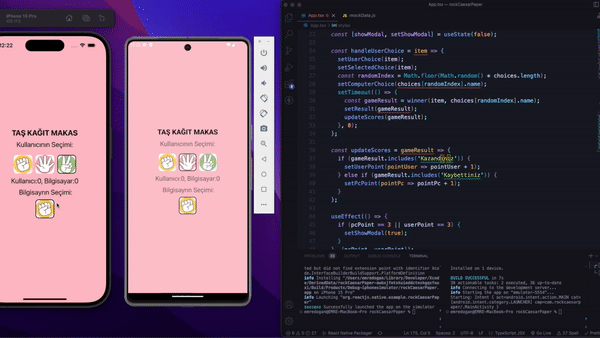

# Rock, Paper, Scissors game.

## This React Native application includes the "Rock, Paper, Scissors" game. The user selects one of the buttons in the interface to make a choice. Subsequently, the result of the game is determined by comparing the user's choice with the computer's randomly generated choice. Using state management, the scores for both the user and the computer are updated. When a specific score limit is reached, a modal window informs the user of the results.

